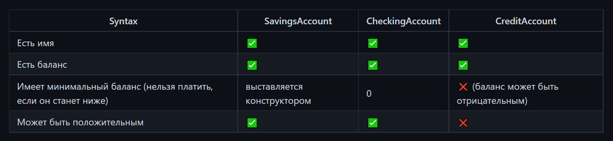

# Домашнее задание.
# Тема: "Модификаторы доступа, наследование, полиморфизм, абстракции, интерфейсы"
Построен на базе следующих технологий:
* Java
## Банковские счета (модификаторы доступа, наследование)
* Систему из классов, описывающую банковские счета
* Система расположена пакете accounts
* У каждого счёта есть баланс (long) и имя владельца (String)
* У каждого счёта есть две операции: оплатить (pay(long amount)) и пополнить (add(long amount));
* Каждая операция возвращает boolean о том, успешно ли она прошла
* Есть три вида счёта: накопительный (SavingsAccount), расчётный (CheckingAccount) и кредитный (CreditAccount)
* Счета реализуют следующую логику
* 
## Клиент (полиморфизм)
* Иметь имя
* При создании клиента помимо имени указывается максимальное количество счетов, которое он может завести
* Метод добавления нового счёта (приходит параметром);
нрзжщплшнесли превышено максимальное количество счетов, то должно выводиться сообщение об этом пользователю
6оуг4куу 47рр
## MoneyTarget (интерфейс)
* Реализация в классе Client. Добавлет пополнениее на тот счет, который может принять сумму пополнения.